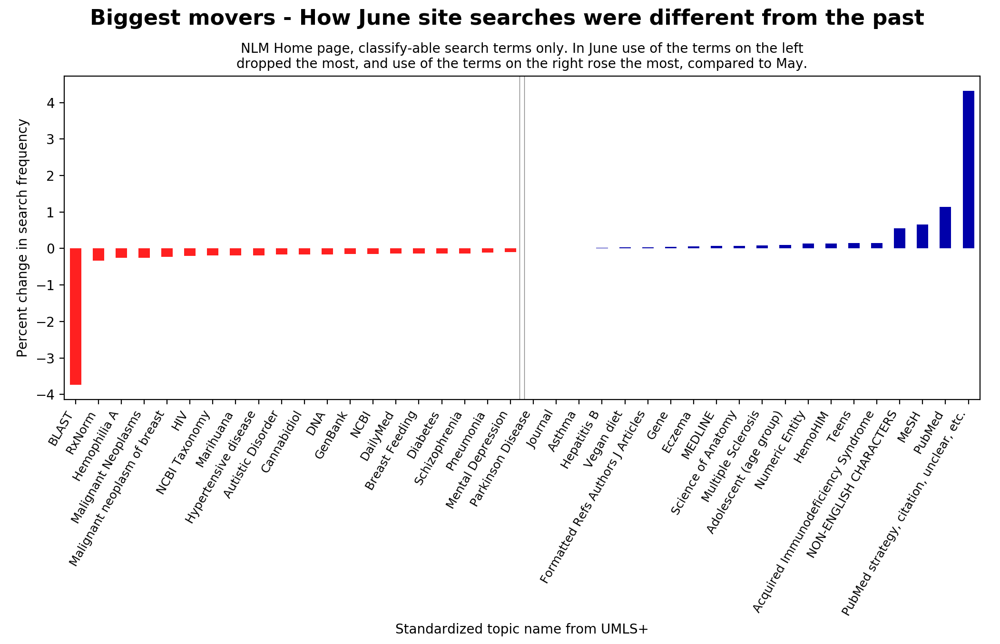
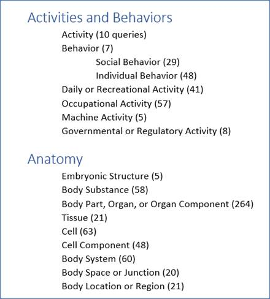
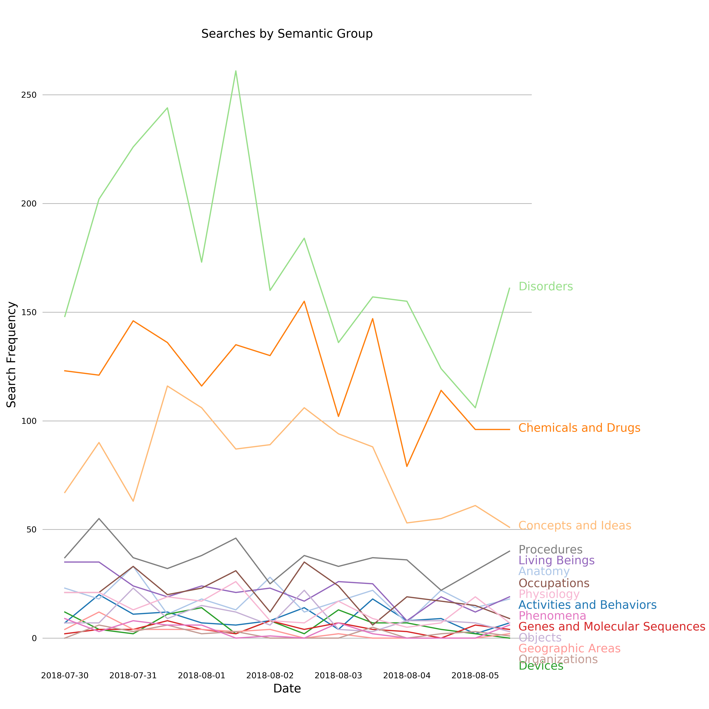
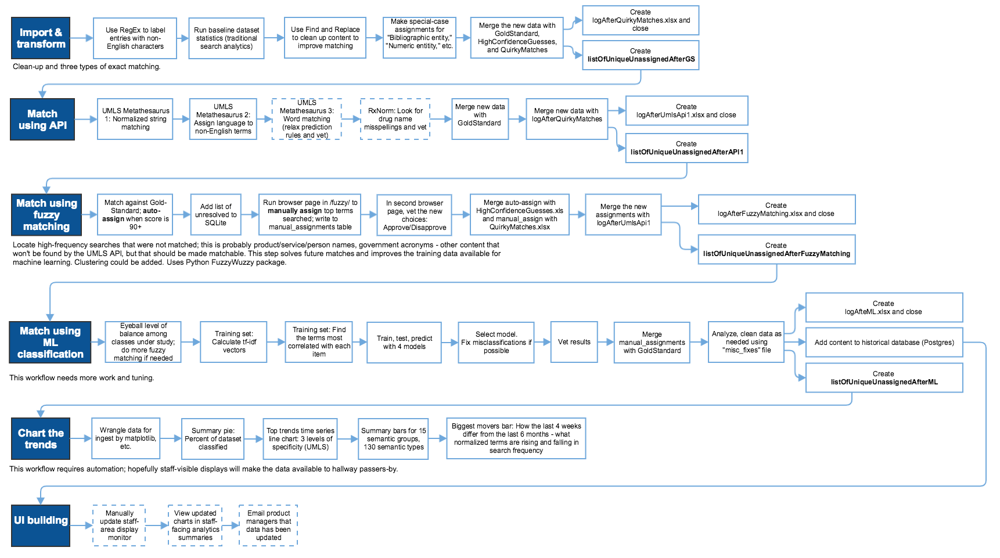

# Semantic Search Log Analysis Pipeline (SSLAP)

> **Chart and respond to trends in information seeking, by classifying your web visitor queries to an ontology**

(Code is under revision. Not fully functional.)

The logs for internal search for large biomedical web sites can be too verbose and too inharmonious to make sense of. Logs for one NIH site contains more than 200,000 queries per month, with many variations on the same conceptual ideas. Aggregating log entries such as "ObamaCare" and "ACA" and "Affordable Care Act," for example, is far too difficult for a human to parse and take action on. This leads to several missed opportunities in communication management.

Product managers and others COULD BE using this data to understand the environment and their customers better, and improve their web sites, but without automation, the amount of human effort required has not been worth the return on the investment. If there were a way to automatically unite queries that are similar but not the same, under broader topics that could be effectively aggregated and compared over time, then we could more easily explore patterns in the vast amount of data generated, and begin to interpret their meaning.

## Goals/Scope 

Benefits of analyzing site search that were addressed in the current work - we will be able to:

1. **Cluster and analyze trends that we know about.** For multi-faceted topics that directly relate to our mission, we could create customized analyses using Python to collect the disparate keywords people might search for, into a single "bucket." Where in the site is there interest in various facets of this subject? Analyzing a trend can show us new constellations of resources that we may not be treating as related. If we were to select a constellation topic such as "opioids" as a topic of study, our bucket might include terms around Fentanyl, heroin, drug treatment, overdose, emergency medicine, etc.), and we could then look at where this person should be in our site, and change the site to help them get there.
2. **Focus staff work onto new trends, as the trends emerge.** When something new starts to happen that can be matched to our mission statement, we can start new content projects to address the emerging need.

## Reporting at three levels of specificity / granularity

This project standardizes multiple customer versions of a search concept into one concept that can be accurately aggregated.

The [Unified Medical Language System (UMLS)](https://www.nlm.nih.gov/research/umls/quickstart.html) API offers a **preferred term** for what site visitors typed, when possible.  We also include "fuzzy matching" against data from a web site spidering, because many product and service names, proper names, and other entities are not covered by UMLS. Here, a before-and-after study of how search behavior changed after a home page redesign.

Given a preferred term, the UMLS API can provide one or two (perhaps more) broader grouping categories called [**Semantic Types,**](https://www.nlm.nih.gov/research/umls/META3_current_semantic_types.html), of which there are around 130. (This hierachical report is still under revision.)

At the highest level, there are 15 Semantic Groups that cover all of health-medicine and much of the life sciences, in mutually exclusive categories. Here: small sample dataset of only 7 days.

## How to Install Required Packages

### Hunspell

The product is based on C libraries so before it can be called in Python the libraries must be available on the local machine.
To begin, clone into the repo at [this link](https://github.com/hunspell/hunspell). cd into the directory and then  follow the [instructions](https://github.com/hunspell/hunspell/blob/master/README.md) for your operating system.

If you have a Mac and would rather not use Homebrew to install the required packages: find the non-homebrew instructions for installing autoconf, automake, libtool [here](https://superuser.com/questions/383580/how-to-install-autoconf-automake-and-related-tools-on-mac-os-x-from-source). Find something similar to install boost and gettext. Then, follow the instructions on the ReadMe page beginning at the “Then run the following commands” section of the Compiling on GNU/Linux and Unixes section (assuming you have a Mac or Linux). 

After that is finished, install pyhunspell using pip or, if you prefer conda, use `conda install -c conda-forge hunspell`

## Using the Hunspell Spellchecker

The hunspell spellchecker software is required for checking the spelling of search terms that are not accepted by the UMLS API the first time around. 

The repo includes all the tools to make new dictionaries whenever the SPECIALIST LEXICON is updated. Specifically the affixcompress tool in the src/tools folder. To use the tool, get a list of all the words you want to use sort them, and then run the tool on the list. Note, should only be done within languages as the dictionary creator does seem to derive rules from the words. You can specify more than one set of dictionaries to be used at a time, if you wish.

In the 02_Run_API.py file, under the #Initialize spellchecker is where the .aff and .dic files you create should be listed. More than one set of dictionaries can be listed, I believe.

## Workflow

Whole-project view. We do not have a deployable software package at this time; this repo contains scripts that can be run together or separately.

9/13/2018: Incomplete or not-started elements have a dotted border.

## Future Directions

1. Collapse SPECIALIST LEXICON into a dictionary to be ingested by Hunspell to create better spellchecking to match with search terms.
2. For matching that won't be in UMLS, spider whole website, clustering by text body instead of only the title/metadatheadings. (tf-idf)
3. Other NLP Toolset Integrations: 
  + Google's search algorithm has a very good suggestion system backed by billions of search queries to correct for misspellings - using an available API could be worth looking into instead of reinventing the wheel.
  + Stanford has a toolset for named entity extraction, that could be used on web site pages
4. R&D whether to start pulling down relationships to assist with queries such as yoga nutrition. https://www.nlm.nih.gov/research/umls/META3_current_relations.html
5. R&D switching to beautifulsoup and use tf-idf vectorize; create a word bank for each topic.
8. Consider capturing IDs for preferred terms for later use? So people can use the wikidata, sparql, etc. connections?
