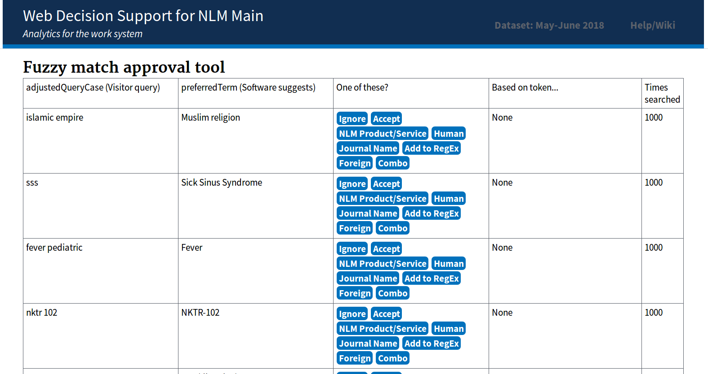
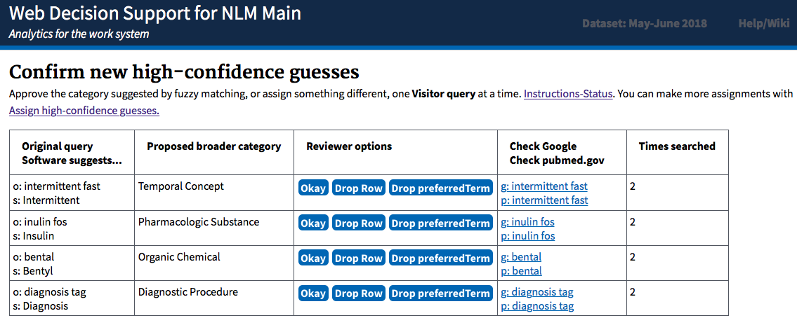

Conversion of Flask application with database access via pandas to django application using ORM and database agnostic.

To create a python virtual environment, activate and install depedencies:

* python3 -m venv /path/to/new/virtual/environment
* source /path/to/new/virtual/environment/bin/activate
* pip install -r requirements.txt

To initialize with the 'gold standard' file, run:

* python manage.py makemigrations
* python manage.py migrate
* python manage.py loaddata assignments.json
* python manage.py runserver

Spyder editor users: In IPython console, use %run instead of python; to end server, Control-C.

Go to http://localhost:8000/fuzzy/
# Approval Interface

# Vetting Interface

